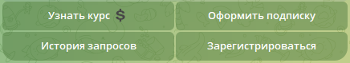
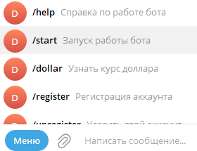
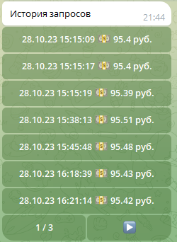
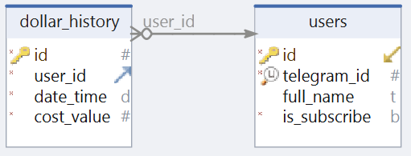
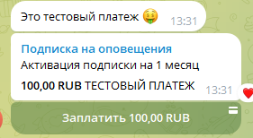

# Описание программы

**DollarRateBot** - асинхронный Telegram бот, разработанный на языке программирования Python. Бот предназначен для предоставления пользователям информации о курсе доллара на текущий момент.

Пользователь также имеет возможность оформить подписку на ежедневные оповещения о курсе доллара. Чтобы пользователю была предоставлена подписка, он должен быть зарегистрирован (для регистрации пользователь должен ввести свои ФИО).

Информация о курсах доллара берется из следующего [источника](https://min-api.cryptocompare.com/data/price?fsym=USD&tsyms=RUB)

Зависимости программы: SQLAlchemy[async], aiohttp, pydantic, asyncpg, AIOgram, python-dotenv

Взаимодейстовать с Телеграм-ботом можно двумя способами:

1. Через инлаин-клавиатуру:



1. Через команды пользовательского Telegram меню:



Вся пользовательская история получения курса доллара хранится в базе данных PostgreSQL.
Telegram-пользователь может в любой момент посмотреть историю его запросов, используя команду `/history` либо нажав на клавишу `История запросов` на инлаин-клавиатуре.

Пример вывода истории запросов пользователя:



Структура базы данных, с которой работает программа **DollarRateBot**, представлена ниже:



Telegram пользователь имеет возможность оформить подписку на ежедневные оповещения о курсе доллара.



Оформление подписки осуществялется через онлаин-оплату. После оплаты Telegram-пользователь может запустить ежедневные оповещения о курсе доллара, применив команду `/begin`

# Стартовая конфигурация

Перед запуском Телеграм-бота убедитесь в наличии в директории с проектом файла ".env", хранящего следующие настройки:

* **BOT_TOKEN** = ...
  > токен телеграм-бота
* **PAYMENTS_TOKEN** = ...
  > токен для создания онлаин-оплаты в Telegram
* **URL** = https://min-api.cryptocompare.com/data/price
  > HTTP адрес, откуда берется информация о курсе доллара
* **DB_HOST** = localhost
  > IP адрес, где находится база данных PostgreSQL
* **DB_PORT** = 5432
  > Сетевой порт для подклчения к базе данных
* **DB_USER** = ...
  > Имя пользователя в PostgreSQL
* **DB_PASS** = ...
  > Пароль для пользователя в PostgreSQL
* **DB_NAME** = dollar_rate
  > Имя базы данных PostgreSQL

# Установка и запуск
## Локальный сервер

Скопируйте репозиторий используя следующую команду:
```
git clone https://github.com/YuryRass/DollarRateBot.git
```

Затем установите необходимые зависимости из файла requirements.txt:
```
pip3 install -r requirements.txt
```

Перед запуском Телеграм-бота у вас должна быть база данных PostgreSQL с названием **DB_NAME**

Если у Вас нет базы данных PostgreSQL, то можно создать и запустить её в docker-контейнере, предварительно заполнив файл `./postgresql/.env`
```
docker-compose -f postgresql/docker-compose.yaml up --build
```
Запуск Телеграм-бота **DollarRateBot**:
```
python3 bot.py
```

## Docker-Compose

Запуск программного средства **DollarRateBot** в docker-контейнерах:
```
docker-compose up --build
```

# Способы расширения базы Telegram пользователей

Расширение базы Telegram пользователей до 100 000 аккаунтов возможно с применением [Local Bot API Server](https://core.telegram.org/bots/api#using-a-local-bot-api-server)