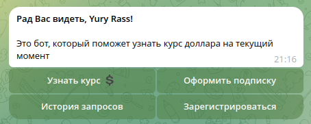
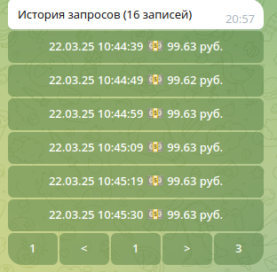
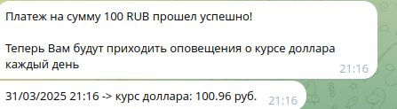

# Описание программы

**DollarRateBot** - асинхронный Telegram бот на вебхуках, разработанный на языке программирования Python. Бот предназначен для предоставления пользователям информации о курсе доллара на текущий момент.

Пользователь также имеет возможность оформить подписку на ежедневные оповещения о курсе доллара. Чтобы пользователю была предоставлена подписка, он должен быть зарегистрирован (для регистрации пользователь должен ввести свои ФИО).

Информация о курсах доллара берется из следующего [источника](https://min-api.cryptocompare.com/data/price?fsym=USD&tsyms=RUB)

## Первая версия программы

Зависимости программы: SQLAlchemy[async], aiohttp, pydantic, asyncpg, AIOgram, FastAPI, uvicorn

Взаимодейстовать с Телеграм-ботом можно двумя способами:

1. Через инлаин-клавиатуру:


2. Через команды пользовательского Telegram меню:


Вся пользовательская история получения курса доллара хранится в базе данных PostgreSQL.
Telegram-пользователь может в любой момент посмотреть историю его запросов, используя команду `/history` либо нажав на клавишу `История запросов` на инлаин-клавиатуре.

Пример вывода истории запросов пользователя:


Структура базы данных, с которой работает программа **DollarRateBot**, представлена ниже:


Telegram пользователь имеет возможность оформить подписку на ежедневные оповещения о курсе доллара.


Оформление подписки осуществялется через онлаин-оплату. После оплаты Telegram-пользователь может запустить ежедневные оповещения о курсе доллара, применив команду `/begin`

## Вторая версия программы
Зависимости программы: SQLAlchemy[async], aiohttp, pydantic, asyncpg, AIOgram, faststream, FastAPI, Aiogram-Dialog, uvicorn, APScheduler, aiormq

Взаимодейстовать с Телеграм-ботом можно через инлаин-клавиатуру, созданную через AIOGram-Dialog:





Вся пользовательская история получения курса доллара хранится в базе данных PostgreSQL.
Telegram-пользователь может в любой момент посмотреть историю его запросов, иcпользуя клавишу `История запросов` на инлаин-клавиатуре. При это в показ истории встроена пагинация с количеством отображаемых страниц на экране = 6. Для пагинации используется виджет `ScrollingGroup` библиотеки AIOGram-Dialog

Пример вывода истории запросов пользователя:




Telegram пользователь имеет возможность оформить подписку на ежедневные оповещения о курсе доллара.

Оформление подписки осуществялется через онлаин-оплату. После оплаты автоматически запускаются ежедневные оповещения о курсе доллара с использованием `APScheduler` и брокера сообщений `RabbitMQ`



# Стартовая конфигурация

Перед запуском Телеграм-бота убедитесь в наличии в директории с проектом файла ".env", хранящего следующие настройки:

* **BOT_TOKEN** = ...
  > токен телеграм-бота
* **PAYMENTS_TOKEN** = ...
  > токен для создания онлаин-оплаты в Telegram
* **URL** = https://min-api.cryptocompare.com/data/price
  > HTTP адрес, откуда берется информация о курсе доллара
* **DB_HOST** = localhost
  > IP адрес, где находится база данных PostgreSQL
* **DB_PORT** = 5432
  > Сетевой порт для подклчения к базе данных
* **DB_USER** = ...
  > Имя пользователя в PostgreSQL
* **DB_PASS** = ...
  > Пароль для пользователя в PostgreSQL
* **DB_NAME** = dollar_rate
  > Имя базы данных PostgreSQL
* **RABBITMQ_USERNAME** = user
  > Имя пользователя в RabbitMQ
* **RABBITMQ_PASSWORD** = password
  > Пароль для пользователя в RabbitMQ
* **RABBITMQ_HOST** = host
  > Имя сервера где расположен RabbitMQ
* **RABBITMQ_PORT** = 5672
  > Порт для RabbitMQ
* **CUSTOM_BOT_API** = http://localhost:8081
  > URL адрес, где будет запущен [Local Bot API Server](ttps://core.telegram.org/bots/api#using-a-local-bot-api-server)
* **URL_WEBHOOK** = https://
  > URL адрес вебхука
* **SHEDULER_SENDING_DOLLAR_RATE_PREFIX** = prefix
  > Префикс для scheduler-задач при присваивании задачам имени
* **DOLLAR_RATE_QUEUE** = q__dollar_rate
  > Название очереди для периодической отправки курса доллара

# Установка и запуск
## Локальный сервер

Скопируйте репозиторий используя следующую команду:
```
git clone https://github.com/YuryRass/DollarRateBot.git
```

Затем установите необходимые зависимости из файла requirements.txt:
```
pip3 install -r requirements.txt
```

Перед запуском Телеграм-бота у вас должна быть база данных PostgreSQL с названием **DB_NAME** и брокер сообщений RabbitMQ по адресу **RABBITMQ_HOST** (для второй версии телеграм бота)

Если у Вас нет базы данных PostgreSQL и брокера RabbitMQ, то можно создать и запустить их в docker-контейнере, предварительно заполнив файл `./docker/.env`
```
docker-compose -f docker/docker-compose.yaml up --build
```
Запуски Телеграм-бота **DollarRateBot**:
```
uvicorn app.main_v1:app -> 1 версия

uvicorn app.main_v2:app -> 2 версия
```


# Способы расширения базы Telegram пользователей

Расширение базы Telegram пользователей до 100 000 аккаунтов возможно с применением [Local Bot API Server](https://core.telegram.org/bots/api#using-a-local-bot-api-server)

После установки утилиты `telegram-bot-api` необходимо её запустить (без передачи аргументов), заранее проинициализировав переменные окружения **TELEGRAM_API_ID** и **TELEGRAM_API_HASH** значениями, которые получились [здесь](https://my.telegram.org/auth?to=apps)

После выполнения команды `telegram-bot-api` запустится локальной **API Bot Server** по адресу http://localhost:8081
